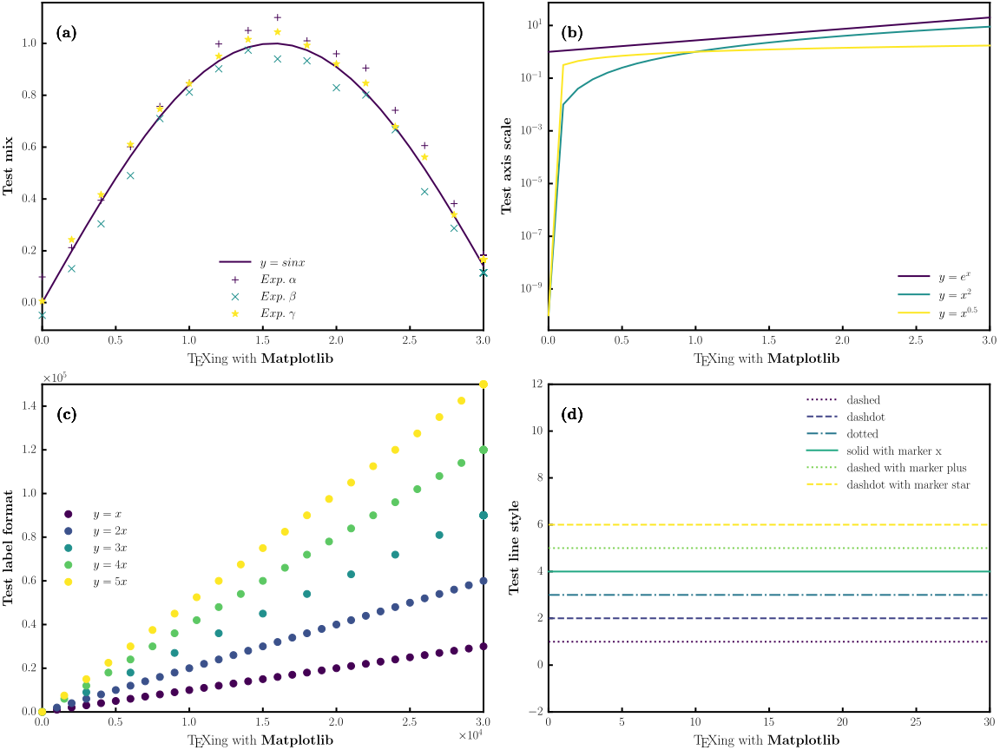

# whosplot

A lightweight, scientific-style plotting toolkit based on Matplotlib. 




## Requirements

- Python 3.8+
- Matplotlib, NumPy (and Pillow if you manipulate image margins)
- (Optional) TeX Live / MiKTeX when using LaTeX text

---

## How to install

with the aid of setup.py
> cd whosplot  
> python -m pip install .

---

## How to use

You typically **subclass `Run`** and then call one or more plotting methods.  
Minimal example:

```python

from whosplot.run import Run

class MyStyle(Run):
    """
    Inherit from `Run` to reuse:
      - data/config loading
      - style & layout initialization
      - plotting APIs (two_d_subplots, color_gradient_two_d_subplots, etc.)
      - utilities (save_fig, show, text, set_axis_off, ...)

    Customize by:
      - overriding __init__ to inject your own setup if needed
      - adding convenience methods (e.g., `my_figure`) that call the base APIs
    """
    def __init__(self):
        # Initialize the base class: reads config.ini, parses CSV, builds figure/axes.
        super(MyStyle, self).__init__()

    def my_figure(self):
        """
        Produce a 2D subplot figure using the current config/CSV and save/show it.
        - The plot “kind” (plot/scatter/mix) is controlled by `figure_kind` in config.
        - If using 'mix', `mixed_ylegend` selects which series are rendered as scatter.
        """
        # Draw all subplots according to the parsed CSV and your config settings.
        self.two_d_subplots()

        # Save the generated figure. (File name is derived from file_location)
        self.save_fig(fig_format='pdf')

        # Open the saved file using the OS default PDF viewer.
        self.show(fig_format='pdf')


# Instantiate and run once.
MyStyle = MyStyle()
MyStyle.my_figure()

```

## Two "magic strings" in "whosplot"

> These special tokens are parsed from the **CSV header row** and control how subfigures, series and labels are arranged.

1) **`whos_plot`**  
   In "whosplot", we often put legend on **Y** column in the header row. Then what we put on **X** column? It is **`whos_plot`**.

2) **`::` (double colon)**  
   Used **inside a header cell** to declare axis labels in one shot:  
   `XLabel :: YLabel`  
   - Left side -> x-axis label  
   - Right side -> y-axis label

   **`::`** is also the separator of each subfigure  
   If we want to plot two subfigures in one frame, then we make header of CSV like this:  
   `XLabel1 :: YLabel1, Legend1, whos_plot, Legend2, XLabel2 :: YLabel2, Legend3, whos_plot, Legend4`

---

## CSV data format

Each **series** is represented by **two adjacent columns**: one **X** column and one **Y** column. A subplot may contain **one** or **many** series.

### A) One X -> one Y (single series)

Header row (two columns):
```
Time (s) :: Velocity (m/s), Velocity — baseline
```
- Column 1 header contains `XLabel :: YLabel` → x-label = “Time (s)”; y-label = “Velocity (m/s)”.  
- Column 2 header is the **legend name** for this series.

Data rows (example):
```
0.0, 0.00
0.1, 0.23
0.2, 0.46
```

### B) Multiple X -> multiple Y (multiple series in the same subplot)

Use **`whos_plot`** to bind the group:

- In the **first series** of that subplot, put **legend name in the Y header**.
- In **every remaining series**, put **`whos_plot` in the X header**, and put the **legend name in the Y header**.

> Note: If **Y** columns share one **X**, then other **X** columns can be omitted except the first **X** column.

Example with two Y-series that share the same X:

Header row (four columns = two pairs):
```
Time (s) :: Velocity (m/s), Pressure — set A, whos_plot, Pressure — set B
```
Data rows (example):
```
0.0, 100100, 0.0, 101325
0.1, 100200, 0.1, 101410
0.2, 100300, 0.2, 101520
```
**Or**  

Header row (three columns = two pairs):
```
Time (s) :: Velocity (m/s), Pressure — set A, Pressure — set B
```
Data rows (example):
```
0.0, 100100, 101325
0.1, 100200, 101410
0.2, 100300, 101520
```
Interpretation:
- Pair 1 -> X header: `Time (s) :: Velocity (m/s)` (declares axis labels), Y header: `Pressure — set A` (legend text).  
- Pair 2 -> X header: `whos_plot` (means: the second series’ X), Y header: `Pressure — set B` (the second legend text).

> Note: Avoid to use comma `, ` in CSV header.

---

## Axis labels via `::`

Wherever you write `XLabel :: YLabel` in a header cell, the framework reads
- **left of `::`** -> **x-axis label**
- **right of `::`** -> **y-axis label**

`::` also means the start of a subfigure.  

This is two subfigures in one frame:
```
X::Y, whos_plot, X::Y, whos_plot
```

This is three subfigures in one frame:
```
X::Y, whos_plot, X::Y, whos_plot, X::Y, whos_plot
```


---

## TeX text rendering

If you want LaTeX styling in labels or tick labels:
- **Install a TeX distribution** first.
- Default option is using LaTex.

---

## Plot kinds: `plot`, `scatter`, `mix`

Choose the **kind** per subplot:

- **`plot`** – draws **lines** (with optional markers).  
- **`scatter`** – draws **markers only**.  
- **`mix`** – draws a **hybrid** (e.g., lines with markers and/or per-series scatter) according to your style settings.

---

## Minimal settings (config)

Below is a compact, ready-to-adapt `config.ini` template.  
**Outer brackets** correspond to the **figure/subplot list**; **inner brackets** are **per-subplot** options.

```ini
[Default]

file_location = data
; Both absolute path and file name are accepted. Required!

figure_kind = ['mix'] * 1
; set as ['plot', 'scatter', 'mix', ...] ; Attention, only string type in list is readable. Required!
; The length of the list is the same as figure number.

y_label_type = ['linear'] * 1
; ['linear', 'log', 'symlog', 'logit', 'function', ...], Default is linear.
; Setting as y_label_type = None is also valid.

x_label_type = ['linear'] * 1
; Ditto. 

y_ticklabel_format = ['plain'] * 1
; ['plain', 'scientific', 'sci', ...], Default is plain.
; Setting as y_label_type = None is also valid.

x_ticklabel_format = ['plain'] * 1
; Ditto. 

side_ylabel = None
; On the horizon ... ...

mixed_ylegend = [[1]] * 1
; Example: mixed_ylegend = [[x1, y1, y2, y3], [], [] ]
; If markers and lines are plotted in the same figure, each subplot’s mixed_ylegend lists the indices of the series to render as scatter
; the others are drawn as lines

title = None
; ['title1', 'title2', ...], Default is None.

line_with_marker = [True] * 1
; Whether to draw markers on lines for 'plot'/'mix'.

legend_location = ['best'] * 1
; ['best', 'upper right', 'upper left', 'lower left', 'lower right', ...], Default is 'best'.

limited_label = [[0,5,0,5]] * 1
; [[xmin, xmax, ymin, ymax], [......], ...], if xmin and xmax equals zero,
; it will turn off the limitation of x-axis.

color_map = ['viridis'] * 1
; Perceptually Uniform Sequential: viridis, plasma, inferno, magma, cividis.

figure_matrix = [1, 1]
; Grid layout of subplots as [rows, cols]

figure_size = [8, 6.5]
; size in inches (width, height) of subfigure.

multi_line_style = [['-','-','--','-.','-','-','-']] * 1
; Per-subplot list of line styles.

debug_mode = False
```

### Reading the bracketed settings
- The **first pair of brackets** (e.g., `[...] * N`) controls how many **subplots** you have and assigns a value per subplot.
- Any **nested bracket** inside corresponds to **that subplot’s internal list**, e.g. multiple line styles or mixed legends.

---


# Play with examples and enjoy!